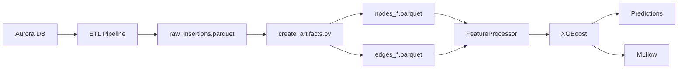

# Technical Architecture

**Purpose**: Document the technical architecture of the fraud detection system.

> 📊 For domain knowledge (fields, relations), see [`knowledge_base.md`](knowledge_base.md)  
> 🔄 For data pipeline, see [`dataflow.md`](dataflow.md)  
> 📓 For experiments, see [`experiment_journal.md`](experiment_journal.md)

---

## System Overview

```
┌─────────────────────────────────────────────────────────────────────────────┐
│                         FRAUD DETECTION PIPELINE                            │
├─────────────────────────────────────────────────────────────────────────────┤
│                                                                             │
│  ┌──────────┐    ┌──────────────┐    ┌─────────────┐    ┌──────────────┐   │
│  │ Database │───▶│ ETL Pipeline │───▶│ Artifacts   │───▶│ Model Train  │   │
│  │ (Aurora  │    │ (src/data)   │    │ (Parquet)   │    │ (XGBoost)    │   │
│  │ Postgres)│    │              │    │             │    │              │   │
│  └──────────┘    └──────────────┘    └─────────────┘    └──────────────┘   │
│                                            │                    │           │
│                                            ▼                    ▼           │
│                                    ┌─────────────┐      ┌─────────────┐    │
│                                    │ Graph Build │      │ MLflow      │    │
│                                    │ (PyG)       │      │ Tracking    │    │
│                                    └─────────────┘      └─────────────┘    │
│                                                                             │
└─────────────────────────────────────────────────────────────────────────────┘
```

---

## Package Structure

```
ppa-fraud-notebook/
├── conf/                           # Hydra Configuration
│   ├── config.yaml                 # Main config (entry point)
│   ├── data/default.yaml           # Database & ETL settings
│   ├── features/auto.yaml          # Auto feature selection (default)
│   └── model/xgboost.yaml          # XGBoost hyperparameters
│
├── artifacts/                      # Generated Data (gitignored)
│   ├── raw_insertions.parquet      # ETL output (234k rows, 292 cols)
│   ├── nodes_*.parquet             # Graph nodes
│   ├── edges_*.parquet             # Graph edges
│   ├── graph.pt                    # PyTorch Geometric graph
│   ├── results/                    # Experiment results (JSON)
│   └── embeddings_*.pt             # GNN embeddings (optional)
│
├── src/
│   ├── data/                       # Data Pipeline
│   │   ├── pipeline.py             # ETL orchestrator (Hydra entry)
│   │   ├── etl/
│   │   │   ├── extract.py          # SQL queries to Aurora
│   │   │   ├── transform.py        # JSON flattening, type conversion
│   │   │   └── load.py             # Write parquet
│   │   └── graph/
│   │       ├── create_artifacts.py # Node/edge parquet creation
│   │       └── graph_structure.py  # Graph structure (uses features below)
│   │
│   ├── features/                   # Feature Engineering & Data Splitting
│   │   ├── registry.py             # Feature category registry
│   │   ├── processor.py            # FeatureProcessor (auto mode)
│   │   ├── temporal_split.py       # Temporal splitting utilities
│   │   ├── graph_node_features.py  # GNN node feature engineering
│   │   ├── definitions/
│   │   │   ├── base.py             # Tabular features
│   │   │   └── graph.py            # Graph-derived features
│   │   └── generators/
│   │       ├── graph_features.py   # Basic graph features (PageRank, degree)
│   │       └── advanced_graph_features.py  # Advanced (betweenness, clustering)
│   │
│   ├── models/                     # Model Training
│   │   ├── train.py                # Main orchestrator (Hydra entry)
│   │   ├── config/
│   │   │   └── constants.py        # EXCLUDED_COLUMNS, GRAPH_FEATURES
│   │   ├── xgboost/
│   │   │   ├── trainer.py          # Generic single-window trainer
│   │   │   └── utils.py            # Feature validation
│   │   ├── gnn/                    # GNN Hybrid (Phase 2)
│   │   │   └── sage.py             # GraphSAGE + XGBoost hybrid
│   │   └── hyperopt/               # Hyperparameter tuning
│   │       ├── xgboost.py          # Optuna-based optimization
│   │       └── pytorch.py          # GraphSAGE hyperopt
│   │
│   ├── experiments/                # Experiment Scripts (Phase 1)
│   │   ├── utils.py                # Shared: prepare_features, train_and_evaluate
│   │   ├── results.py              # Results registry (save/load JSON)
│   │   ├── exp01_graph_value.py    # RQ1: Graph feature value
│   │   ├── exp02_concept_drift.py  # RQ3: Retraining necessity
│   │   ├── exp03_shap.py           # RQ4: SHAP explainability
│   │   ├── exp04_feature_engineering.py  # Methodology validation
│   │   └── exp05_unsupervised.py   # Supervisor: Unsupervised comparison
│   │
│   └── utils/                      # Utilities
│       ├── hydra_utils.py          # Path resolution
│       ├── evaluate_seon.py        # SEON baseline (one-time)
│       └── logger.py               # Logging setup
│
├── notebooks/                      # Jupyter Analysis
│   ├── exp01_graph_value.ipynb     # Exp 1 analysis
│   ├── exp02_concept_drift.ipynb   # Exp 2 analysis
│   ├── exp03_shap.ipynb            # Exp 3 analysis
│   ├── exp04_feature_engineering.ipynb  # Exp 4 analysis
│   ├── exp05_unsupervised.ipynb    # Exp 5 analysis
│   └── data_quality_analysis.ipynb # Data quality report
│
├── docs/                           # Documentation
│   ├── architecture.md             # This file
│   ├── dataflow.md                 # Data pipeline
│   ├── knowledge_base.md           # Domain knowledge
│   ├── experiment_journal.md       # Experiment definitions
│   ├── statistical_analysis.md     # Statistical methodology
│   ├── limitations.md              # Limitations & threats
│   └── data_engineering_principles.md  # Best practices
│
├── mlruns/                         # MLflow tracking (gitignored)
├── .venv/                          # Python virtual environment
├── requirements.txt                # Python dependencies
├── pyproject.toml                  # Project metadata
└── README.md                       # Quick start guide
```

---

## Model Architecture (High Level)

### Design Philosophy

**Clean Separation of Concerns**:
```
Config (Hydra) → Orchestrator → Data Splitting → Feature Processing → Generic Trainer
```

The architecture follows these principles:
1. **Config-driven**: Hydra configs control dataset selection, split strategy, features
2. **Orchestration layer**: Main scripts (`train.py`, `sage.py`) coordinate the pipeline
3. **Temporal splitting in features**: `AccumulatingWindowSplitter` handles time-series splits
4. **Generic trainer**: `train_single_window()` just trains on given data (no splitting logic)
5. **XGBoost as final predictor**: All models feed into XGBoost for the final decision

| Model | Features | XGBoost Input |
|-------|----------|---------------|
| **XGBoost (Primary)** | Tabular + Graph | ~235 features |
| **GraphSAGE Hybrid (Optional)** | Tabular + GNN Embeddings | ~200 tabular + 64D embedding |

This simplifies the architecture:
- Single prediction interface (XGBoost)
- Single evaluation metric (AUC-PR, Precision, Recall)
- Easy A/B testing (swap feature source, keep XGBoost)
- Trainer is reusable across different orchestration strategies

---

## Model Implementations

### 1. XGBoost (Primary Model)

**Architecture**:
```python
# High-level flow with orchestration
Config (config.yaml)
  → train.py (Orchestrator)
      ├─ Load dataset (load_data)
      ├─ Create temporal splits (AccumulatingWindowSplitter)
      └─ For each window:
          ├─ Process features (FeatureProcessor)
          │   → ~235 features (218 tabular + 17 graph)
          └─ Train model (train_single_window)
  → XGBoost classifier
  → Fraud probability
              → Log to MLflow
```

**Key Components**:
- **Orchestrator**: `src/models/train.py`
  - Coordinates entire training pipeline
  - Loads dataset, creates splits, processes features
  - Calls generic trainer per window
- **Temporal Splitter**: `src/features/temporal_split.py`
  - `AccumulatingWindowSplitter`: Time-series cross-validation
  - `TemporalTrainTestSplitter`: GNN train/test split
- **Feature Processor**: `src/features/processor.py`
  - Auto-selects all tabular features (minus exclusions)
  - Computes graph features (PageRank, degree, clustering)
  - Label-encodes categorical columns
- **Generic Trainer**: `src/models/xgboost/trainer.py`
  - `train_single_window()`: Trains on given train/test data
  - No splitting logic (pure training function)
  - Logs metrics to MLflow
- **Configuration**: `conf/model/xgboost.yaml`
  - Hyperparameters (learning rate, depth, etc.)
  - Training parameters (window sizes, step sizes)

**Hyperparameters** (default):
```yaml
learning_rate: 0.1
max_depth: 6
min_child_weight: 5
subsample: 0.8
colsample_bytree: 0.8
gamma: 0.1
scale_pos_weight: 11.2  # Computed from fraud rate
```

### 2. GraphSAGE Hybrid (Phase 2 - Optional)

**Architecture**:
```python
# High-level flow with orchestration
Config (config.yaml)
  → sage.py (Hybrid Orchestrator)
      ├─ Train GraphSAGE (once)
      │   ├─ Load graph (graph_structure.py)
      │   ├─ Temporal split (TemporalTrainTestSplitter)
      │   └─ Train GNN → Save best model
      ├─ Create embedding generator
      ├─ Load dataset
      ├─ Create temporal splits (AccumulatingWindowSplitter)
      └─ For each window:
          ├─ Process base features (FeatureProcessor)
          ├─ Generate embeddings (per-window, temporally fair)
          │   → Node embeddings (64D)
          ├─ Concatenate features + embeddings
          └─ Train XGBoost (train_single_window)
  → Fraud probability
```

**Key Components**:
- **Graph Structure**: `src/data/graph/graph_structure.py`
  - Creates PyTorch Geometric `HeteroData` object
  - 6 node types (user, listing, ip, email, phone, address)
  - 8+ edge types (user-posts-listing, etc.)
- **Graph Features**: `src/features/graph_node_features.py`
  - Node feature engineering (separate from structure)
  - Listing: 419-dim features (numerical, categorical, embeddings)
  - Other nodes: Simple features
- **GNN Model**: `src/models/gnn/sage.py`
  - **GraphSAGE**: Inductive graph neural network
  - Homogeneous model converted to heterogeneous via `to_hetero()`
  - Mean aggregation for robust neighbor combination
  - Skip connections to prevent over-smoothing
- **Embedding Flow**:
  - GNN trained once on temporal split (80/20)
  - Per-window: Generate embeddings on temporally-filtered graph
  - Concatenate embeddings with base features
  - Train XGBoost on hybrid features

**Why GraphSAGE**:
- ✅ **Inductive learning**: Handles new nodes in accumulating windows
- ✅ **Simple & robust**: Mean aggregation generalizes well
- ✅ **Production-ready**: Fast inference, easy to deploy
- ✅ **Proven**: Widely used in fraud detection systems

**Why Not HGT** (removed):
- ❌ More transductive (learns specific node relationships)
- ❌ Complex attention mechanisms harder to generalize
- ❌ Overkill for sparse graphs with simple structural patterns

### 3. Graph Structure

**Graph Schema**:
```python
# PyTorch Geometric HeteroData
graph = {
    'listing': {
        'x': [234458, D],           # Node features
        'y': [234458],              # Fraud labels
        'object_reference': [234458] # IDs
    },
    ('listing', 'shared_email', 'listing'): {
        'edge_index': [2, E1]       # Edge connectivity
    },
    ('listing', 'shared_phone', 'listing'): {
        'edge_index': [2, E2]
    },
    # ... 8 edge types total
}
```

**Edge Types** (see `knowledge_base.md` for details):
- `shared_contact_email` (98% coverage)
- `shared_billing_phone` (98% coverage)
- `shared_ip` (84% coverage)
- `same_owner` (100% coverage)
- `same_ppa_person` (94% coverage)
- `same_region` (100% coverage)
- `same_street` (100% coverage)
- `shared_contact_phone` (70% coverage)

---

## Configuration Framework

### Hydra (Configuration Management)

**Purpose**: Manage experiment configurations declaratively.

**Config Structure**:
```yaml
# conf/config.yaml (main entry point)
defaults:
  - data: default        # Database connection, ETL settings
  - features: auto       # Feature selection mode
  - model: xgboost       # Model hyperparameters

experiment_name: "ppa-fraud-detection"
seed: 42
```

**Override Example**:
```bash
# Run with different feature mode
python -m src.models.train features=auto

# Override specific params
python -m src.models.train model.learning_rate=0.05 model.max_depth=8
```

**Hydra Benefits**:
- Type-safe configs (via OmegaConf)
- Easy experimentation (override any param)
- Automatic output directories
- Config versioning (saved with each run)

### MLflow (Experiment Tracking)

**Purpose**: Track all training runs, metrics, and artifacts.

**What Gets Tracked**:
```python
# Automatically logged
mlflow.log_params({
    "learning_rate": 0.1,
    "max_depth": 6,
    "features_mode": "auto",
    "n_features": 235
})

mlflow.log_metrics({
    "auc_pr": 0.67,
    "auc_roc": 0.95,
    "precision": 0.87,
    "recall": 0.75
})

mlflow.log_artifacts([
    "feature_importance.png",
    "confusion_matrix.png"
])
```

**MLflow UI**:
```bash
# Start server
mlflow ui --port 5000

# View at http://127.0.0.1:5000
```

**Experiment Organization**:
```
ppa-fraud-detection/          # Default experiment
├── run_abc123 (2025-12-09)   # Each training run
├── run_def456 (2025-12-10)
└── ...

exp01-graph-value/            # Experiment 1
├── run_xyz789
└── ...

exp02-concept-drift/          # Experiment 2
└── ...
```

### Why Both Hydra AND MLflow?

| Tool | Purpose | When Used |
|------|---------|-----------|
| **Hydra** | Configuration management | Before training (set params) |
| **MLflow** | Experiment tracking | During/after training (log results) |

They're complementary:
- Hydra: "What config am I using?"
- MLflow: "What results did I get?"

---

## Data Flow Architecture



**Detailed flow**: See [`dataflow.md`](dataflow.md)

---

## Deployment Architecture (Conceptual)

### Training Pipeline
```
Weekly Schedule:
1. Extract new data from Aurora (incremental)
2. Update graph artifacts (new nodes/edges)
3. Retrain XGBoost (accumulating window)
4. Evaluate on latest week
5. Log to MLflow
6. If AUC-PR > threshold: promote model
```

### Inference Pipeline
```
Real-time (API):
1. New listing submitted
2. Fetch user features from cache
3. Compute graph features (if graph exists)
4. Load XGBoost model from MLflow
5. Predict fraud probability
6. If prob > 0.7: flag for review
```

---

## Technology Stack

### Core Libraries

| Component | Library | Version | Purpose |
|-----------|---------|---------|---------|
| **ML Framework** | XGBoost | 2.0+ | Gradient boosting |
| **Graph ML** | PyTorch Geometric | 2.4+ | GNN (Phase 2) |
| **Data** | Polars | 0.19+ | Fast DataFrame operations |
| **Config** | Hydra | 1.3+ | Configuration management |
| **Tracking** | MLflow | 2.8+ | Experiment tracking |
| **DB** | psycopg2 | 2.9+ | PostgreSQL driver |
| **Viz** | matplotlib, seaborn | | Plotting |

### Development Tools

| Tool | Purpose |
|------|---------|
| **Jupyter** | Notebook analysis |
| **pytest** | Unit testing |
| **black** | Code formatting |
| **mypy** | Type checking |
| **ruff** | Linting |

---

## Scalability Considerations

### Current Scale

| Metric | Value |
|--------|-------|
| **Listings** | 234k |
| **Features** | ~235 |
| **Training Time** | ~5 min (single window) |
| **Memory** | ~8GB peak |
| **Disk** | ~500MB (artifacts) |

### Bottlenecks

| Component | Bottleneck | Solution |
|-----------|------------|----------|
| **Graph creation** | Memory (10M+ edges) | Incremental update, not full rebuild |
| **Feature computation** | CPU (graph metrics) | Cache graph features |
| **Training** | Time (120+ windows for drift eval) | Parallel window evaluation |

### Future Scaling

For 10x scale (2.3M listings):
- **Distributed graph**: Use Apache Spark GraphX or Neo4j
- **Incremental training**: Don't retrain from scratch
- **Feature store**: Cache computed features
- **Model serving**: Deploy via FastAPI + Docker

---

## Testing Strategy

### Unit Tests
```python
# tests/test_features.py
def test_feature_processor():
    processor = FeatureProcessor(categories=['base'])
    df, features = processor.process(data)
    assert len(features) > 0
    assert all(col in df.columns for col in features)
```

### Integration Tests
```python
# tests/test_pipeline.py
def test_etl_to_training():
    # Run full pipeline
    run_etl()
    create_graph_artifacts()
    train_model()
    # Verify outputs exist
```

### Experiment Reproducibility
- All experiments use fixed `seed=42`
- Hydra saves full config with each run
- MLflow tracks all hyperparameters
- Git commit hash logged to MLflow

---

## Security Considerations

| Risk | Mitigation |
|------|------------|
| **Data Leakage** | Strict temporal splits, no future data |
| **PII Exposure** | All contacts hashed, no raw emails/phones |
| **Model Stealing** | MLflow access control (if deployed) |
| **Adversarial Attacks** | Multi-feature redundancy, weekly retraining |

---

## References

- Configuration: `conf/config.yaml`
- Data pipeline: [`dataflow.md`](dataflow.md)
- Domain knowledge: [`knowledge_base.md`](knowledge_base.md)
- MLflow docs: https://mlflow.org
- Hydra docs: https://hydra.cc
