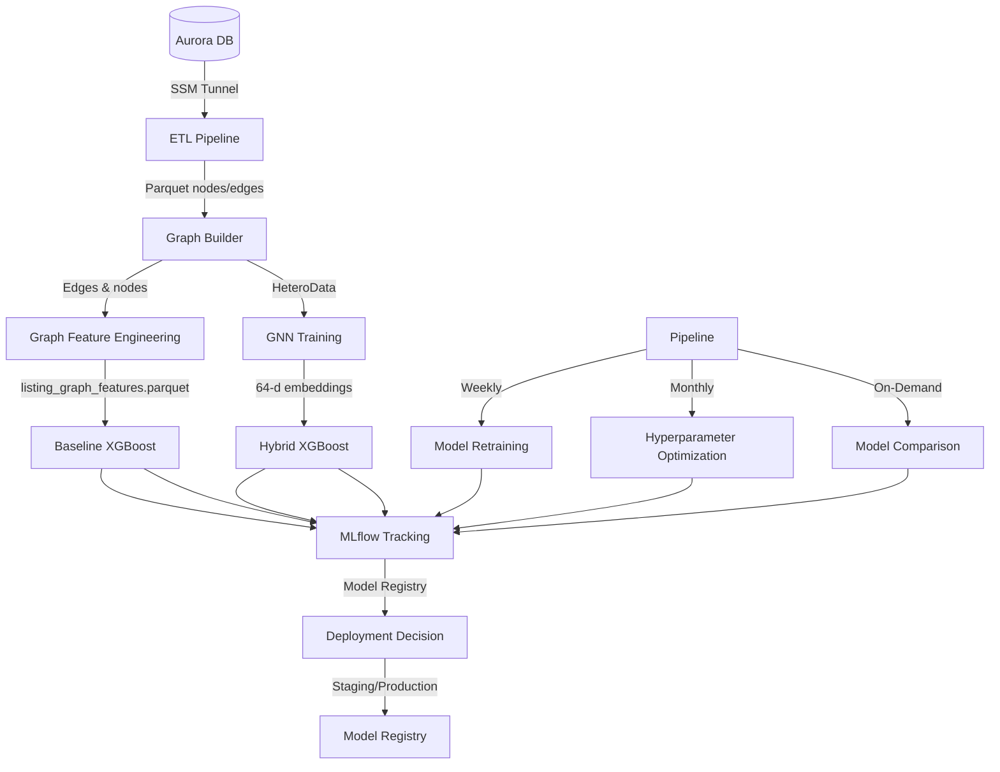
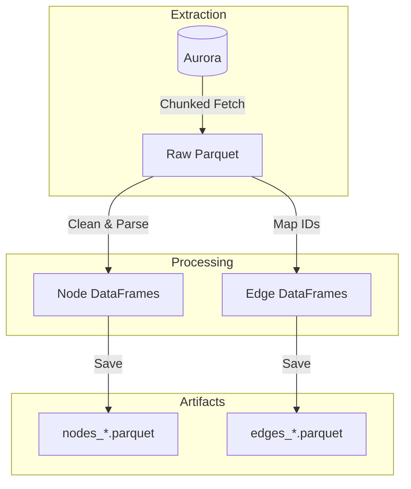
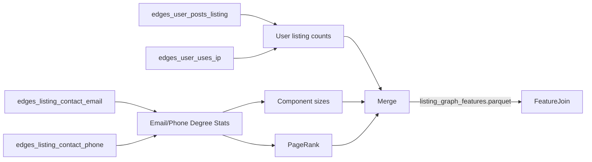
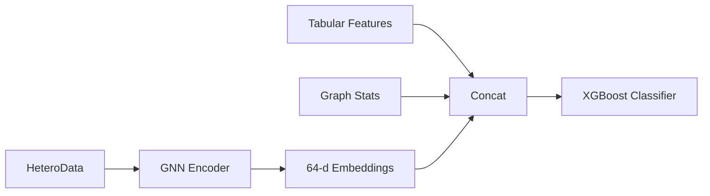

# Architecture Overview: Continuous Fraud Detection System

This document captures the current architecture (Nov 2025), including the production-ready graph-feature baseline, continuous learning framework, and research hybrid workflow.

## 1. System Architecture



**Key Paths**:
* **Production**: tabular features + engineered graph statistics → XGBoost → MLflow → Model Registry → Deployment
* **Research**: tabular + graph statistics + residual HGT embeddings → XGBoost (experimental)

## 2. ETL Pipeline (`src/data/etl.py`)

**Goal**: Efficiently transform raw data from the Aurora PostgreSQL database into structured Parquet files.

*   **Database Access**: Connects to Aurora via `DB_URI` environment variable. SSM tunneling (if required) should be established externally before running ETL.
*   **Batching**: Fetches data in chunks (10,000 rows) to handle large datasets (millions of insertions) without OOM errors.
*   **Checkpointing**: Saves raw data to `artifacts/raw_*.parquet` to avoid re-fetching.



## 3. Graph Construction (`src/data/graph_builder.py`)

**Goal**: Convert tabular Parquet files into a unified PyTorch Geometric `HeteroData`.

* **Nodes**: `user`, `listing`, `ip`, `email`, `phone`, `address`, `person`.
* **Edges** (converted to undirected):
  * `user` → `posts` → `listing`
  * `user` → `uses` → `ip`
  * `user` → `has_email` → `email`
  * `listing` → `has_contact_email` / `has_inquiry_email` → `email`
  * `listing` → `has_contact_phone` → `phone`
  * `listing` → `located_at` / `lister_address` / `billing_address` → `address`
  * `listing` → `has_contact_person` → `person`
* **Temporal handling**: listing timestamps and edge timestamps are preserved to support sliding-window filtering and prevent leakage.

## 4. Graph Feature Engineering (`src/features/graph_features.py`)



*   **Outputs per listing** (filled with 0 when absent):
    1. Contact email/phone degrees, shared-contact totals, max shared contact.
    2. User/IP reuse (listings per user, unique IP count, shared IP totals/max).
    3. Connected-component size induced by shared contacts.
    4. PageRank centrality on the listing-contact bipartite graph.
*   **Purpose**: Provide deterministic, interpretable structural signals for XGBoost without training a GNN.

## 5. Model Architectures

### 5.1 Production: Graph-Feature Baseline
**Status**: ✅ **Production Default**

This model combines powerful tabular features with manually engineered graph statistics. It outperforms end-to-end GNNs because explicit counts (e.g., "shared emails = 5") are easier for tree-based models to exploit than over-smoothed embeddings.

**Input Features**:
- **Tabular** (14-dim): `account_age_days`, `log_price`, `living_space`, `rooms`, `is_new`, `bundle_period`, etc.
- **Graph Stats** (12-dim): Recency-weighted degrees, shared contacts count, component sizes, PageRank.

**Architecture**:
```
XGBoost Classifier
├── n_estimators: 100
├── max_depth: 6
├── learning_rate: 0.1
├── objective: binary:logistic
└── eval_metric: aucpr
```

**Training Strategy**:
- **Method**: Accumulating Window (all historical data up to train_end, 14-day test).
- **Feature Engineering**: See Section 4.

---

### 5.2 Research: GNN Encoders
End-to-end graph neural networks used for generating embeddings. While currently outperformed by the baseline, they capture latent structure.

#### 5.2.1 Graph Attention Network (GAT)
Uses attention mechanisms to learn importance weights for neighbors.
- **Architecture**: 2-layer GATConv (64 hidden dims, 4 heads).
- **Input**: Heterogeneous node features + edge types.
- **Best for**: Learning which specific neighbors matter most.

#### 5.2.2 GraphSAGE
Inductive learning using neighborhood sampling and aggregation.
- **Architecture**: 2-layer SAGEConv (Mean aggregation).
- **Pros**: Scalable, inductive (handles new nodes gracefully).

#### 5.2.3 Heterogeneous Graph Transformer (HGT)
Designed for heterogeneity with type-specific attention.
- **Architecture**: 2-layer HGTConv (64 hidden dims, 4 heads).
- **Pros**: Automatically handles different node/edge types without manual metapath definition.

#### 5.2.4 HGT + RTE (Relative Temporal Encoding)
Augments HGT with time-gap embeddings.
- **Mechanism**: $\Delta t$ injected into attention scoring.
- **Pros**: Distinguishes between ancient history and recent "bursts".

---

### 5.3 Research: Hybrid Models
Combines GNN embeddings with the production baseline.

**Architecture**:


**Feature Vector**: 90 dimensions (14 Tabular + 12 Graph Stats + 64 Embeddings).

## 6. Model Comparison Matrix

| Model | Parameters | Training Time | Best For |
|-------|-----------|---------------|----------|
| **Baseline XGBoost** | ~10K | Fast (~1 min) | Tabular-only baseline |
| **Graph-Feature XGBoost** | ~10K | Fast (~1 min + prep) | **Production** (High Precision) |
| **GAT / SAGE** | ~50K | Medium (~10 min) | Homogeneous/Bipartite graphs |
| **HGT / HGT+RTE** | ~60K+ | Slow (~15 min) | Complex heterogeneous graphs |
| **Hybrid** | GNN + 10K | GNN time + Fast | Research / Ensembling |

## 7. Hyperparameter Tuning

### XGBoost (Baseline & Hybrid)
- **max_depth**: {4, 6, 8} - Deeper = complex rules (risk of overfitting).
- **learning_rate**: {0.05, 0.1, 0.2} - Lower is more stable.
- **scale_pos_weight**: Critical for fraud (class imbalance).

### GNNs
- **hidden_channels**: {32, 64} - 64 is standard.
- **num_heads**: {2, 4} - 4 helps stabilize attention.
- **num_layers**: {1, 2} - 2 layers is usually sufficient (2-hop neighborhood).

## 8. Research Cheat Sheet (The "Why" & "How")

### The Graph Structure
*   **Heterogeneity**: Modeling different entities (`User` vs `IP`) captures semantics that homogeneous graphs miss.
*   **Bridge Nodes**: Technical nodes (`IP`, `Device`) connect seemingly unrelated users, exposing "Fraud Rings."

### The Engine (HGT + RTE)
*   **Relative Temporal Encoding (RTE)**: Embeds the time gap $\Delta T$ into the attention mechanism.
*   **Benefit**: Distinguishes between normal behavior (years of history) and suspicious bursts (seconds between creation and posting).

### The Cold Start Solution
*   **Problem**: Pure GNNs fail on new listings (Degree 0) because they have no connections.
*   **Solution**: The Hybrid model falls back on **Tabular Features** (Price, Location) when graph signal is weak, ensuring robustness.

### Evaluation Strategy
*   **Sliding Window**: 90-day Train / 14-day Test.
*   **Metrics**:
    *   **AUC-PR**: Primary metric (focus on minority class).
    *   **Precision@100**: Operational efficiency (how many real frauds in the top 100?).

## 9. Continuous Learning Framework

The system follows MLflow best practices for model lifecycle management, deployment, and drift detection.

**Key Components**:
- **MLflow Integration**: Experiment tracking, model versioning, artifact management
- **Model Registry**: Versioning, staging, and production deployment
- **MLflow-Native Comparison**: Model comparison and drift detection using MLflow APIs

### 9.1 MLflow Integration

All training runs are automatically tracked in MLflow with:
- Hyperparameters and configuration
- Per-window and aggregate metrics
- SHAP summary plots (via `mlflow.evaluate()`)
- Model artifacts and versioning
- Model Registry for staging/production promotion

### 9.2 Model Registry and Deployment

The system uses MLflow Model Registry for production-ready model management:

**Model Registry Workflow**:
1. **Training**: Models are automatically registered during training
2. **Staging**: New models are compared against production and promoted to Staging if they meet criteria
3. **Production**: Staging models are promoted to Production after validation
4. **Drift Detection**: Recent versions are compared to detect performance degradation

**Deployment Decision Logic**:
- **PRODUCTION**: Significant improvement (≥1% absolute, ≥1% relative) → Direct production deployment
- **STAGING**: Small improvement (>0% but <threshold) → Staging for validation
- **REJECT**: No improvement or degradation → Reject candidate

**Usage**:
```bash
# Compare two model runs
python src/cli.py mlflow-compare-models --production-run-id abc123 --candidate-run-id def456

# Get deployment recommendation (compares against production in Model Registry)
python src/cli.py mlflow-deployment-recommendation --candidate-run-id abc123

# Analyze drift across recent model versions
python src/cli.py mlflow-drift-summary --model-name fraud-detection-baseline_graph
```

**Model Comparison Features**:
- Compares all metrics (AUC-PR, P@100, etc.)
- Calculates absolute and percentage improvements
- Provides deployment recommendations
- Tracks drift across model versions

**Benefits of MLflow-Native Approach**:
- Standard MLflow workflows (no custom code)
- Integrated with MLflow UI for visualization
- Model Registry provides audit trail
- Supports automated deployment pipelines
- Industry-standard best practices

## 10. Commands Reference

### Data Pipeline
*   **ETL**: `make etl`
*   **Build Graph**: `make build-graph`
*   **Graph Features**: `make graph-features`

### Training
*   **Train Baseline (with graph features)**: `make train-baseline`
*   **Train SAGE Hybrid Model**: `make train-sage`
*   **Train HGT Hybrid Model**: `make train-hgt`
*   **Note**: All training commands automatically use MLflow tracking and register models to the Model Registry

### Continuous Learning
*   **MLflow**: 
    *   `make mlflow-ui` - Start MLflow UI
    *   `make mlflow-compare` - Compare runs by metric
    *   `make mlflow-promote` - Promote model to Production
*   **Model Management**:
    *   `make mlflow-compare-models PROD_RUN=<id> CAND_RUN=<id>` - Compare two runs
    *   `make mlflow-deployment-recommendation CAND_RUN=<id>` - Get deployment recommendation
    *   `make mlflow-drift-summary` - Analyze model drift

### Analysis
*   **Notebooks**: 
    *   `notebooks/01_raw_data_exploration.ipynb` - Raw data
    *   `notebooks/02_data_exploration.ipynb` - Processed features
    *   `notebooks/05_shap_analysis.ipynb` - SHAP + Adaptation Engine
