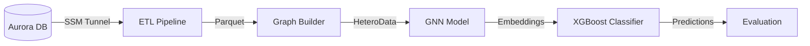
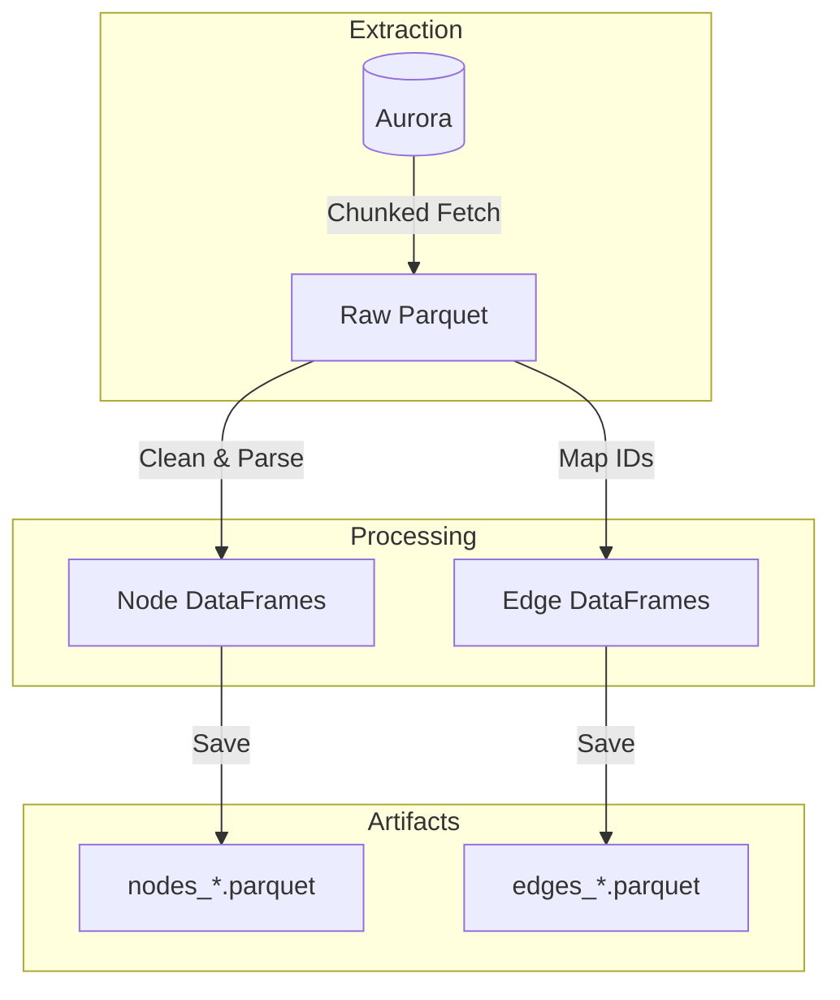

# Architecture Overview: Hybrid GNN-XGBoost Fraud Detection

This document outlines the end-to-end architecture of the fraud detection system, from raw data extraction to model training and evaluation.

## 1. System Architecture

## 2. ETL Pipeline (`src/data/etl.py`)

**Goal**: Efficiently transform raw data from the Aurora PostgreSQL database into structured Parquet files.

*   **Tunneling**: Automatically manages AWS SSM tunnels to securely access the production DB.
*   **Batching**: Fetches data in chunks (e.g., 5000 rows) to handle large datasets (millions of insertions) without OOM errors.
*   **Checkpointing**: Saves raw data to `artifacts/raw_*.parquet` to avoid re-fetching.

## 3. Graph Construction (`src/data/graph_builder.py`)

**Goal**: Convert tabular Parquet files into a PyTorch Geometric `HeteroData` object.

*   **Schema**:
    *   **Nodes**: `User`, `Listing`, `IP`, `Email`, `Phone`, `Location`.
    *   **Edges**:
        *   `User` -> `posts` -> `Listing`
        *   `User` -> `uses` -> `IP` / `Email` / `Phone`
        *   `Listing` -> `located_at` -> `Location`
*   **Temporal Handling**: All edges have timestamps to prevent data leakage (Time Travel).

## 4. Model Architecture

We use a **Hybrid Architecture** that combines the structural learning of GNNs with the tabular performance of XGBoost.

### Stage 1: Representation Learning (GNN)
*   **Variants**: `GAT`, `GCN`, `HGT`, `HGT+RTE`.
*   **Input**: Full Heterogeneous Graph.
*   **Task**: Train on `fraud_flag` (Binary Classification).
*   **Output**: Extract dense **node embeddings** (64-dim) for each listing.

### Stage 2: Classification (XGBoost)
*   **Input**: [Tabular Features] + [GNN Embeddings].
*   **Features**:
    *   **Tabular**: Price, Size, Rooms, Zip, Account Age.
    *   **Embeddings**: 64-dim vector capturing graph neighborhood.
*   **Model**: XGBoost Classifier.

## 5. Research Cheat Sheet (The "Why" & "How")

### The Graph Structure
*   **Heterogeneity**: Modeling different entities (`User` vs `IP`) captures semantics that homogeneous graphs miss.
*   **Bridge Nodes**: Technical nodes (`IP`, `Device`) connect seemingly unrelated users, exposing "Fraud Rings."

### The Engine (HGT + RTE)
*   **Relative Temporal Encoding (RTE)**: Embeds the time gap $\Delta T$ into the attention mechanism.
*   **Benefit**: Distinguishes between normal behavior (years of history) and suspicious bursts (seconds between creation and posting).

### The Cold Start Solution
*   **Problem**: Pure GNNs fail on new listings (Degree 0) because they have no connections.
*   **Solution**: The Hybrid model falls back on **Tabular Features** (Price, Location) when graph signal is weak, ensuring robustness.

### Evaluation Strategy
*   **Sliding Window**: 90-day Train / 14-day Test.
*   **Metrics**:
    *   **AUC-PR**: Primary metric (focus on minority class).
    *   **Precision@100**: Operational efficiency (how many real frauds in the top 100?).

## 6. Commands

*   **ETL**: `make etl`
*   **Build Graph**: `make build-graph`
*   **Train Baseline**: `make train-baseline`
*   **Run Experiments**:
    *   `make exp-gat`
    *   `make exp-gcn`
    *   `make exp-hgt`
    *   `make exp-hgt-rte`
*   **Compare**: Open `notebooks/03_model_comparison.ipynb`.
