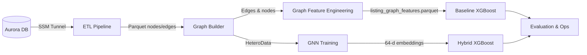
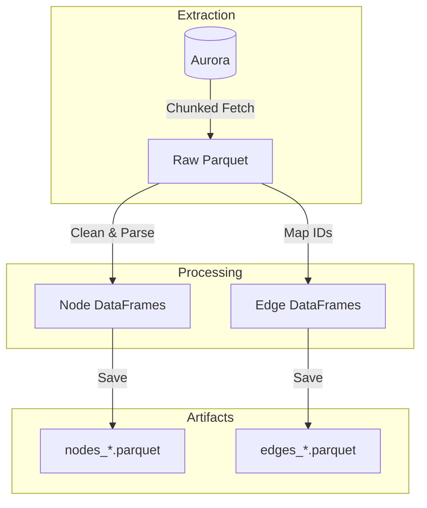
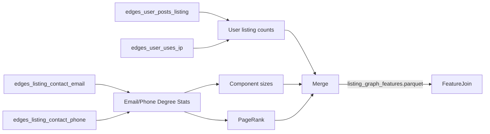
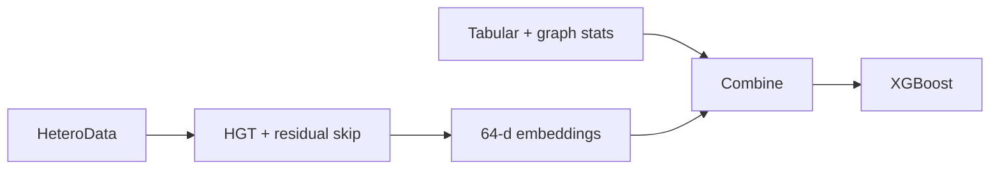

# Architecture Overview: Graph Feature Baseline & Hybrid GNN-XGBoost

This document captures the current architecture (Nov 2025), including the production-ready graph-feature baseline and the research hybrid workflow.

## 1. System Architecture

* **Baseline path**: tabular features + engineered graph statistics → XGBoost (production choice).
* **Hybrid path**: tabular + graph statistics + residual HGT embeddings → XGBoost (research).

## 2. ETL Pipeline (`src/data/etl.py`)

**Goal**: Efficiently transform raw data from the Aurora PostgreSQL database into structured Parquet files.

*   **Tunneling**: Automatically manages AWS SSM tunnels to securely access the production DB.
*   **Batching**: Fetches data in chunks (e.g., 5000 rows) to handle large datasets (millions of insertions) without OOM errors.
*   **Checkpointing**: Saves raw data to `artifacts/raw_*.parquet` to avoid re-fetching.

## 3. Graph Construction (`src/data/graph_builder.py`)

**Goal**: Convert tabular Parquet files into a unified PyTorch Geometric `HeteroData`.

* **Nodes**: `user`, `listing`, `ip`, `email`, `phone`, `address`, `person`.
* **Edges** (converted to undirected):
  * `user` → `posts` → `listing`
  * `user` → `uses` → `ip`
  * `user` → `has_email` → `email`
  * `listing` → `has_contact_email` / `has_inquiry_email` → `email`
  * `listing` → `has_contact_phone` → `phone`
  * `listing` → `located_at` / `lister_address` / `billing_address` → `address`
  * `listing` → `has_contact_person` → `person`
* **Temporal handling**: listing timestamps and edge timestamps are preserved to support sliding-window filtering and prevent leakage.

## 4. Graph Feature Engineering (`src/features/graph_features.py`)

*   **Outputs per listing** (filled with 0 when absent):
    1. Contact email/phone degrees, shared-contact totals, max shared contact.
    2. User/IP reuse (listings per user, unique IP count, shared IP totals/max).
    3. Connected-component size induced by shared contacts.
    4. PageRank centrality on the listing-contact bipartite graph.
*   **Purpose**: Provide deterministic, interpretable structural signals for XGBoost without training a GNN.

## 5. Model Architectures

### 5.1 Graph-Feature Baseline (Production Default)

*   **Features**: Tabular columns (account age, price, rooms, bundle info, etc.) + engineered graph stats.
*   **Model**: Sliding-window XGBoost (90-day train / 14-day test).
*   **Performance**: Mean AUC-PR 0.6655, Mean AUC-ROC 0.9392.

### 5.2 Residual Hybrid HGT (Research Track)

*   **Representation learning**: `UnifiedGNNWrapper` concatenates the listing self projection with the aggregated neighbor message before projection, mitigating over-smoothing.
*   **Classifier input**: [Tabular + graph stats] + [Embeddings] (currently 14 + 12 + 64 = 90 features).
*   **Performance**: Mean AUC-PR 0.6484 (better than the old hybrid 0.5909, but still below the graph-feature baseline).

## 6. Research Cheat Sheet (The "Why" & "How")

### The Graph Structure
*   **Heterogeneity**: Modeling different entities (`User` vs `IP`) captures semantics that homogeneous graphs miss.
*   **Bridge Nodes**: Technical nodes (`IP`, `Device`) connect seemingly unrelated users, exposing "Fraud Rings."

### The Engine (HGT + RTE)
*   **Relative Temporal Encoding (RTE)**: Embeds the time gap $\Delta T$ into the attention mechanism.
*   **Benefit**: Distinguishes between normal behavior (years of history) and suspicious bursts (seconds between creation and posting).

### The Cold Start Solution
*   **Problem**: Pure GNNs fail on new listings (Degree 0) because they have no connections.
*   **Solution**: The Hybrid model falls back on **Tabular Features** (Price, Location) when graph signal is weak, ensuring robustness.

### Evaluation Strategy
*   **Sliding Window**: 90-day Train / 14-day Test.
*   **Metrics**:
    *   **AUC-PR**: Primary metric (focus on minority class).
    *   **Precision@100**: Operational efficiency (how many real frauds in the top 100?).

## 7. Commands

*   **ETL**: `make etl`
*   **Build Graph**: `make build-graph`
*   **Graph Features**: `make graph-features`
*   **Train Baseline (tabular only)**: `make train-baseline`
*   **Train Graph-Feature Baseline**: `make train-graph-baseline`
*   **Hybrid (HGT example)**:
    *   `python src/cli.py train-embeddings --model hgt`
    *   `python src/cli.py train-hybrid --model hgt`
*   **Legacy experiments**: `make exp-gat`, `make exp-sage`, `make exp-hgt`, `make exp-hgt-rte`
*   **Notebooks**: `notebooks/03_model_comparison.ipynb`
