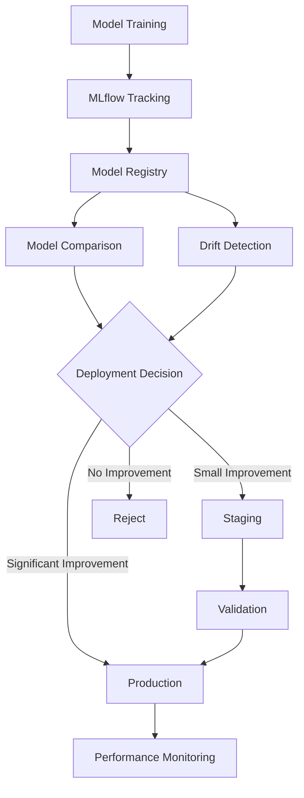

# Continuous Fraud Detection Framework

This document describes the MLflow-based continuous learning framework for fraud detection models. The framework provides automated model lifecycle management, drift detection, and deployment recommendations.

## Overview

The continuous fraud detection framework is built on **MLflow** and follows industry best practices for:
- Experiment tracking and model versioning
- Model Registry for staging and production management
- Automated drift detection and performance monitoring
- Deployment recommendations based on model comparison

## Architecture



## Components

### 1. MLflow Experiment Tracking

All model training runs are automatically tracked in MLflow with:

- **Hyperparameters**: Model configuration (max_depth, learning_rate, etc.)
- **Metrics**: Per-window and aggregate metrics (AUC-PR, P@100, precision, recall)
- **Artifacts**: Model files, SHAP plots, feature importance
- **Tags**: Model type, window index, training mode
- **Model Registry**: Automatic registration of trained models

**Usage**:
```bash
# All training commands automatically use MLflow
make train-baseline    # Baseline XGBoost with graph features
make train-sage         # SAGE hybrid model
make train-hgt         # HGT hybrid model
```

### 2. Model Registry

The Model Registry provides versioning and stage management:

**Stages**:
- **None**: Newly registered models (default)
- **Staging**: Models under validation
- **Production**: Models deployed to production

**Workflow**:
1. **Training**: Models are automatically registered during training
2. **Comparison**: New models are compared against production
3. **Staging**: Models with small improvements are promoted to Staging
4. **Production**: Staging models are promoted to Production after validation
5. **Monitoring**: Production models are monitored for drift

### 3. Model Comparison

Compare models to make informed deployment decisions:

**Comparison Metrics**:
- Primary metric: AUC-PR (Area Under Precision-Recall Curve)
- Secondary metrics: P@100, precision, recall, F1-score
- Improvement thresholds:
  - **Absolute**: ≥0.01 improvement
  - **Relative**: ≥1% improvement

**Deployment Decision Logic**:
- **PRODUCTION**: Significant improvement (≥1% absolute, ≥1% relative) → Direct production deployment
- **STAGING**: Small improvement (>0% but <threshold) → Staging for validation
- **REJECT**: No improvement or degradation → Reject candidate

**Usage**:
```bash
# Compare two specific runs
make mlflow-compare-models PROD_RUN=<id> CAND_RUN=<id>

# Get deployment recommendation (compares against production)
make mlflow-deployment-recommendation CAND_RUN=<id>
```

### 4. Drift Detection

Monitor model performance over time to detect degradation:

**Drift Detection**:
- Compares recent model versions against production
- Flags significant performance degradation (>5% drop)
- Analyzes multiple metrics (AUC-PR, P@100, etc.)
- Provides actionable insights

**Usage**:
```bash
# Analyze drift across recent model versions
make mlflow-drift-summary
```

**Drift Indicators**:
- Performance degradation in key metrics
- Feature importance shifts (via SHAP analysis)
- Distribution changes in predictions

### 5. Model Retraining

Retrain models with updated data:

**Retraining Strategies**:
- **Accumulating Window**: Use all historical data up to train_end
- **Sliding Window**: Use fixed window size (e.g., 90 days)
- **Production Retraining**: Retrain with all historical + production data

**Usage**:
```bash
# Retrain baseline model
make train-baseline

# Retrain with all historical data
make retrain-production

# Optimize hyperparameters
make optimize-hyperparams
```

## Workflow

### Training Workflow

1. **Data Preparation**:
   ```bash
   make etl              # Extract data from database
   make build-graph      # Build graph structure
   make all-features     # Generate all feature types
   ```

2. **Model Training**:
   ```bash
   make train-baseline   # Train baseline model (automatically tracked in MLflow)
   ```

3. **Model Registration**:
   - Models are automatically registered to Model Registry during training
   - Each model version is tagged with metadata (model_type, window_idx, etc.)

### Deployment Workflow

1. **Compare with Production**:
   ```bash
   make mlflow-deployment-recommendation CAND_RUN=<new_run_id>
   ```

2. **Review Recommendation**:
   - Check improvement metrics
   - Review SHAP analysis for feature importance changes
   - Validate on staging data if recommended

3. **Promote to Staging/Production**:
   - Use MLflow UI or CLI to promote models
   - Staging models can be validated before production deployment

### Monitoring Workflow

1. **Check for Drift**:
   ```bash
   make mlflow-drift-summary
   ```

2. **Analyze SHAP Insights**:
   - Use `notebooks/03_shap_analysis.ipynb` to understand feature importance
   - Compare models to identify changes

3. **Retrain if Needed**:
   - If drift is detected, retrain with updated data
   - Compare new model against production

## MLflow UI

Access the MLflow UI to:
- View all experiments and runs
- Compare model metrics
- Browse model artifacts (SHAP plots, feature importance)
- Manage Model Registry (promote models, view versions)

**Usage**:
```bash
make mlflow-ui
# Opens at http://localhost:5000
```

## Integration with SHAP Analysis

SHAP analysis is integrated with the MLflow framework:

1. **Feature Importance**: SHAP values are logged as artifacts during training
2. **Model Comparison**: Use SHAP to understand differences between models
3. **Drift Analysis**: Feature importance changes can indicate drift

**Notebook**: `notebooks/03_shap_analysis.ipynb`

## Best Practices

### Model Versioning
- Always use MLflow Model Registry for production models
- Tag models with meaningful metadata (model_type, window_idx, etc.)
- Keep production models in "Production" stage

### Deployment Decisions
- Always compare against production before deploying
- Use staging for validation of new models
- Monitor production models for drift

### Retraining
- Retrain regularly (weekly/monthly) to incorporate new patterns
- Use accumulating window for production models
- Optimize hyperparameters periodically

### Monitoring
- Check drift summary regularly
- Review SHAP analysis for feature importance changes
- Track key metrics over time in MLflow UI

## CLI Commands Reference

### Training
```bash
make train-baseline              # Train baseline model
make train-sage                   # Train SAGE hybrid model
make train-hgt                    # Train HGT hybrid model
make retrain-production           # Retrain with all historical data
make optimize-hyperparams        # Run hyperparameter optimization
```

### MLflow Management
```bash
make mlflow-ui                    # Start MLflow UI
make mlflow-compare               # Compare runs by metric
make mlflow-compare-models PROD_RUN=<id> CAND_RUN=<id>  # Compare two runs
make mlflow-deployment-recommendation CAND_RUN=<id>      # Get deployment recommendation
make mlflow-drift-summary         # Analyze model drift
```

## Troubleshooting

### No models in Model Registry
- Ensure models are trained with MLflow tracking enabled
- Check that models are registered during training (automatic)

### Drift detection not working
- Ensure production model is in "Production" stage
- Check that recent model versions exist
- Verify metrics are logged correctly

### Deployment recommendation unclear
- Review comparison metrics in detail
- Check SHAP analysis for feature importance changes
- Validate on staging data before production deployment

## Related Documentation

- **Architecture Overview**: `docs/architecture_overview.md`
- **Experiment Journal**: `docs/experiment_journal.md`
- **SHAP Analysis**: `notebooks/03_shap_analysis.ipynb`

