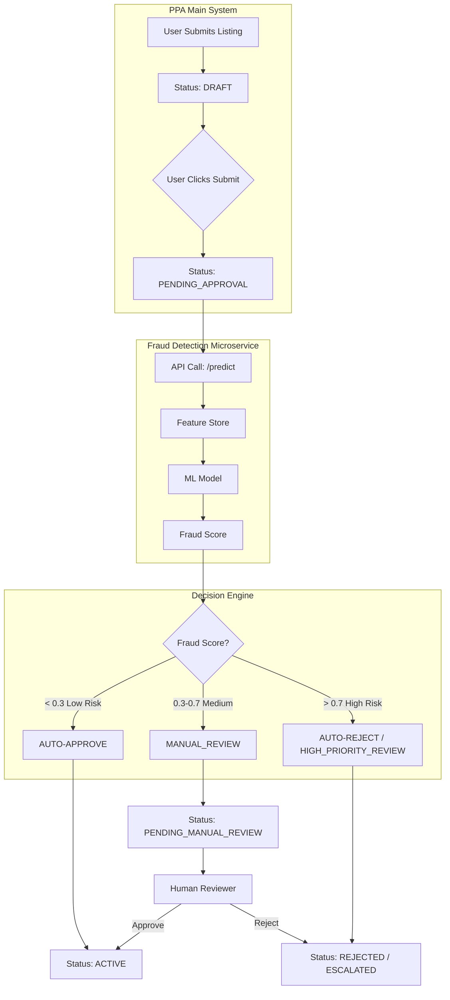
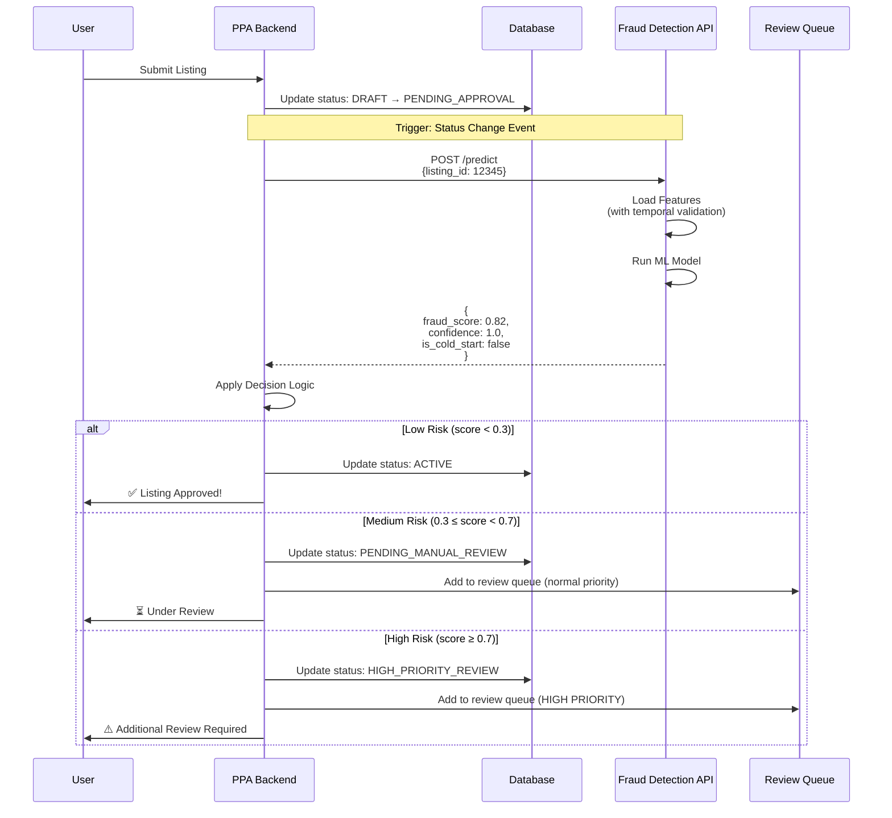
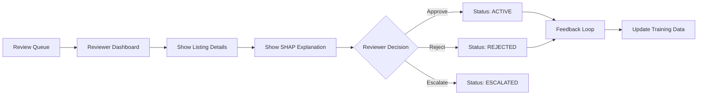
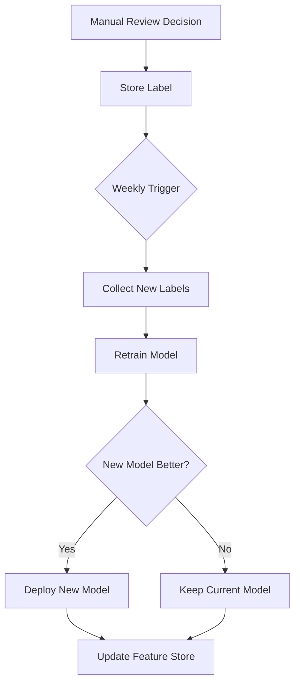
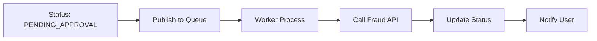

# Fraud Detection Integration Architecture

## System Overview



## Detailed Integration Flow

### AWS Serverless Architecture

```
┌─────────────────────────────────────────────────────────────────────────┐
│                         PPA Listing Submission Flow                      │
└─────────────────────────────────────────────────────────────────────────┘
                                     │
                                     ▼
                    ┌────────────────────────────────┐
                    │  Aurora PostgreSQL (Listings)  │
                    │  Status: DRAFT → PENDING       │
                    └────────────────────────────────┘
                                     │
                                     ▼
                    ┌────────────────────────────────┐
                    │   EventBridge / DB Trigger     │
                    │   (Status Change Detection)    │
                    └────────────────────────────────┘
                                     │
                                     ▼
                    ┌────────────────────────────────┐
                    │        SNS Topic               │
                    │   "listing-fraud-check"        │
                    └────────────────────────────────┘
                                     │
                    ┌────────────────┴────────────────┐
                    │                                 │
                    ▼                                 ▼
        ┌──────────────────────┐        ┌──────────────────────┐
        │   SQS Queue (FIFO)   │        │  Lambda (Trigger)    │
        │  "fraud-check-queue" │        │  High-priority only  │
        └──────────────────────┘        └──────────────────────┘
                    │
                    ▼
        ┌──────────────────────────────┐
        │  Lambda: Fraud Check Worker  │
        │  - Fetch from SQS            │
        │  - Call Fraud API            │
        │  - Apply decision logic       │
        └──────────────────────────────┘
                    │
                    ▼
        ┌──────────────────────────────┐
        │   Fraud Detection API (ECS)  │
        │   FastAPI on Fargate         │
        │   - /predict endpoint        │
        │   - Feature Store            │
        │   - XGBoost Model            │
        └──────────────────────────────┘
                    │
                    ▼
        ┌──────────────────────────────┐
        │    SNS Topic (Results)       │
        │   "fraud-check-results"      │
        └──────────────────────────────┘
                    │
        ┌───────────┴──────────────────┐
        │                              │
        ▼                              ▼
┌──────────────────┐        ┌──────────────────────┐
│ Lambda: Update   │        │  Lambda: Notify User │
│ DB Status        │        │  (SES/SNS)           │
│ - Update Aurora  │        └──────────────────────┘
│ - Log fraud data │
│ - Add to review  │
│   queue if needed│
└──────────────────┘
        │
        ▼
┌──────────────────────────────┐
│     Aurora (Updated)         │
│  Status: ACTIVE (auto)       │
│  Status: PENDING_REVIEW      │
│  Status: HIGH_PRIORITY       │
└──────────────────────────────┘
        │
        ▼ (if review needed)
┌──────────────────────────────┐
│   SQS: Review Queue          │
│   Consumed by reviewer app   │
└──────────────────────────────┘
```

### 1. Listing Submission Flow

### 1. Listing Submission Flow



## Implementation Details (AWS Serverless + TypeScript)

### Architecture Overview

```
Aurora DB Event → EventBridge → SNS Topic → SQS Queue → Lambda (Fraud Check)
                                    ↓
                            Lambda (Fraud API Client)
                                    ↓
                            Fraud Detection API (ECS)
                                    ↓
                            Update Aurora + Send SNS
```

### Step 1: Database Trigger (Aurora → EventBridge)

When listing status changes to `PENDING_APPROVAL`:

```sql
-- Aurora PostgreSQL trigger
CREATE OR REPLACE FUNCTION notify_listing_status_change()
RETURNS trigger AS $$
BEGIN
  IF NEW.status = 'PENDING_APPROVAL' AND OLD.status != 'PENDING_APPROVAL' THEN
    PERFORM aws_lambda.invoke(
      'arn:aws:lambda:region:account:function:fraud-check-trigger',
      json_build_object(
        'listingId', NEW.insertion_id,
        'status', NEW.status,
        'timestamp', NOW()
      )::text
    );
  END IF;
  RETURN NEW;
END;
$$ LANGUAGE plpgsql;

CREATE TRIGGER listing_fraud_check
AFTER UPDATE ON listings
FOR EACH ROW
EXECUTE FUNCTION notify_listing_status_change();
```

**OR** use EventBridge integration:

```typescript
// Alternative: Publish to EventBridge from your API Lambda
import { EventBridge } from '@aws-sdk/client-eventbridge';

const eventBridge = new EventBridge({});

export async function updateListingStatus(
  listingId: number,
  status: string
): Promise<void> {
  // Update DB
  await db.listings.update({ insertion_id: listingId }, { status });
  
  // Publish event
  if (status === 'PENDING_APPROVAL') {
    await eventBridge.putEvents({
      Entries: [{
        Source: 'ppa.listings',
        DetailType: 'ListingStatusChanged',
        Detail: JSON.stringify({
          listingId,
          newStatus: status,
          timestamp: new Date().toISOString(),
        }),
      }],
    });
  }
}
```

### Step 2: Fraud Check Lambda (Triggered by SQS)

```typescript
// lambda/fraud-check/handler.ts
import { SQSEvent, SQSHandler } from 'aws-lambda';
import { SNS } from '@aws-sdk/client-sns';
import axios from 'axios';

const FRAUD_API_URL = process.env.FRAUD_API_URL!;
const FRAUD_RESULTS_TOPIC_ARN = process.env.FRAUD_RESULTS_TOPIC_ARN!;

interface FraudResult {
  fraud_score: number;
  confidence: number;
  is_cold_start: boolean;
  model_version: string;
}

enum FraudDecision {
  AUTO_APPROVE = 'AUTO_APPROVE',
  MANUAL_REVIEW = 'MANUAL_REVIEW',
  HIGH_PRIORITY = 'HIGH_PRIORITY',
  AUTO_REJECT = 'AUTO_REJECT',
}

const sns = new SNS({});

export const handler: SQSHandler = async (event: SQSEvent) => {
  for (const record of event.Records) {
    const { listingId } = JSON.parse(record.body);
    
    try {
      // Call Fraud Detection API
      const fraudResult = await callFraudDetectionAPI(listingId);
      
      // Apply decision logic
      const decision = applyDecisionLogic(fraudResult);
      
      // Publish result to SNS
      await sns.publish({
        TopicArn: FRAUD_RESULTS_TOPIC_ARN,
        Message: JSON.stringify({
          listingId,
          fraudScore: fraudResult.fraud_score,
          decision,
          confidence: fraudResult.confidence,
          isColdStart: fraudResult.is_cold_start,
          modelVersion: fraudResult.model_version,
          timestamp: new Date().toISOString(),
        }),
        MessageAttributes: {
          listingId: { DataType: 'Number', StringValue: String(listingId) },
          decision: { DataType: 'String', StringValue: decision },
        },
      });
      
      console.log(`Fraud check complete for listing ${listingId}: ${decision}`);
      
    } catch (error) {
      console.error(`Fraud check failed for listing ${listingId}:`, error);
      
      // Fallback: Send to manual review
      await sns.publish({
        TopicArn: FRAUD_RESULTS_TOPIC_ARN,
        Message: JSON.stringify({
          listingId,
          decision: FraudDecision.MANUAL_REVIEW,
          error: error.message,
          fallback: true,
        }),
      });
    }
  }
};

async function callFraudDetectionAPI(listingId: number): Promise<FraudResult> {
  const response = await axios.post(
    `${FRAUD_API_URL}/predict`,
    {
      listing_id: listingId,
      as_of_time: new Date().toISOString(),
    },
    { timeout: 5000 } // 5 second timeout
  );
  
  return response.data;
}

function applyDecisionLogic(result: FraudResult): FraudDecision {
  const { fraud_score, confidence, is_cold_start } = result;
  
  // Conservative for cold start
  if (is_cold_start && confidence < 0.7) {
    return FraudDecision.MANUAL_REVIEW;
  }
  
  // Score-based thresholds
  if (fraud_score < 0.3) {
    return FraudDecision.AUTO_APPROVE;
  } else if (fraud_score < 0.7) {
    return FraudDecision.MANUAL_REVIEW;
  } else {
    return FraudDecision.HIGH_PRIORITY;
  }
}
```

### Step 3: Status Update Lambda (Subscribes to SNS)

```typescript
// lambda/update-listing-status/handler.ts
import { SNSEvent, SNSHandler } from 'aws-lambda';
import { RDSDataClient, ExecuteStatementCommand } from '@aws-sdk/client-rds-data';
import { SQS } from '@aws-sdk/client-sqs';

const rds = new RDSDataClient({});
const sqs = new SQS({});

const DB_ARN = process.env.AURORA_CLUSTER_ARN!;
const DB_SECRET_ARN = process.env.DB_SECRET_ARN!;
const DATABASE_NAME = process.env.DATABASE_NAME!;
const REVIEW_QUEUE_URL = process.env.REVIEW_QUEUE_URL!;

interface FraudResultMessage {
  listingId: number;
  fraudScore: number;
  decision: string;
  confidence: number;
  isColdStart: boolean;
  modelVersion: string;
}

export const handler: SNSHandler = async (event: SNSEvent) => {
  for (const record of event.Records) {
    const message: FraudResultMessage = JSON.parse(record.Sns.Message);
    const { listingId, fraudScore, decision, confidence, modelVersion } = message;
    
    // Map decision to status
    const statusMap: Record<string, string> = {
      AUTO_APPROVE: 'ACTIVE',
      MANUAL_REVIEW: 'PENDING_MANUAL_REVIEW',
      HIGH_PRIORITY: 'HIGH_PRIORITY_REVIEW',
      AUTO_REJECT: 'REJECTED',
    };
    
    const newStatus = statusMap[decision] || 'PENDING_MANUAL_REVIEW';
    
    try {
      // Update listing status in Aurora
      await rds.send(new ExecuteStatementCommand({
        resourceArn: DB_ARN,
        secretArn: DB_SECRET_ARN,
        database: DATABASE_NAME,
        sql: `
          UPDATE listings 
          SET 
            status = :status,
            fraud_score = :fraud_score,
            fraud_checked_at = NOW(),
            fraud_model_version = :model_version
          WHERE insertion_id = :listing_id
        `,
        parameters: [
          { name: 'status', value: { stringValue: newStatus } },
          { name: 'fraud_score', value: { doubleValue: fraudScore } },
          { name: 'model_version', value: { stringValue: modelVersion } },
          { name: 'listing_id', value: { longValue: listingId } },
        ],
      }));
      
      // Insert fraud log
      await rds.send(new ExecuteStatementCommand({
        resourceArn: DB_ARN,
        secretArn: DB_SECRET_ARN,
        database: DATABASE_NAME,
        sql: `
          INSERT INTO fraud_logs (
            listing_id, fraud_score, decision, 
            confidence, is_cold_start, model_version, created_at
          ) VALUES (
            :listing_id, :fraud_score, :decision,
            :confidence, :is_cold_start, :model_version, NOW()
          )
        `,
        parameters: [
          { name: 'listing_id', value: { longValue: listingId } },
          { name: 'fraud_score', value: { doubleValue: fraudScore } },
          { name: 'decision', value: { stringValue: decision } },
          { name: 'confidence', value: { doubleValue: confidence } },
          { name: 'is_cold_start', value: { booleanValue: message.isColdStart } },
          { name: 'model_version', value: { stringValue: modelVersion } },
        ],
      }));
      
      // Add to review queue if needed
      if (decision === 'MANUAL_REVIEW' || decision === 'HIGH_PRIORITY') {
        await sqs.sendMessage({
          QueueUrl: REVIEW_QUEUE_URL,
          MessageBody: JSON.stringify({ listingId, fraudScore, decision }),
          MessageAttributes: {
            priority: {
              DataType: 'Number',
              StringValue: decision === 'HIGH_PRIORITY' ? '1' : '5',
            },
          },
        });
      }
      
      console.log(`Updated listing ${listingId} to status ${newStatus}`);
      
    } catch (error) {
      console.error(`Failed to update listing ${listingId}:`, error);
      throw error; // Will retry via SNS
    }
  }
};
```

## Human-in-the-Loop Review Flow



### Reviewer Dashboard Integration (Lambda + API Gateway)

When a reviewer opens a flagged listing, fetch the SHAP explanation:

```typescript
// lambda/get-review-data/handler.ts
import { APIGatewayProxyHandler } from 'aws-lambda';
import { RDSDataClient, ExecuteStatementCommand } from '@aws-sdk/client-rds-data';
import axios from 'axios';

const rds = new RDSDataClient({});
const FRAUD_API_URL = process.env.FRAUD_API_URL!;

export const handler: APIGatewayProxyHandler = async (event) => {
  const listingId = parseInt(event.pathParameters?.listingId || '0');
  
  if (!listingId) {
    return {
      statusCode: 400,
      body: JSON.stringify({ error: 'Missing listing_id' }),
    };
  }
  
  try {
    // Get listing from Aurora
    const listingResult = await rds.send(new ExecuteStatementCommand({
      resourceArn: process.env.AURORA_CLUSTER_ARN!,
      secretArn: process.env.DB_SECRET_ARN!,
      database: process.env.DATABASE_NAME!,
      sql: `
        SELECT l.*, fl.fraud_score, fl.confidence, fl.model_version
        FROM listings l
        LEFT JOIN fraud_logs fl ON l.insertion_id = fl.listing_id
        WHERE l.insertion_id = :listing_id
        ORDER BY fl.created_at DESC
        LIMIT 1
      `,
      parameters: [
        { name: 'listing_id', value: { longValue: listingId } },
      ],
    }));
    
    // Get SHAP explanation from Fraud API
    const explanation = await axios.post(
      `${FRAUD_API_URL}/explain`,
      {
        listing_id: listingId,
        generate_plot: true,
      },
      { timeout: 10000 }
    );
    
    // Extract top red flags (positive SHAP values)
    const redFlags = explanation.data.top_features
      .filter((feat: any) => {
        const value = Object.values(feat)[0];
        return value > 0;
      })
      .slice(0, 5);
    
    return {
      statusCode: 200,
      headers: {
        'Content-Type': 'application/json',
        'Access-Control-Allow-Origin': '*',
      },
      body: JSON.stringify({
        listing: listingResult.records?.[0],
        fraudScore: explanation.data.fraud_score,
        explanation: explanation.data,
        redFlags,
        waterfallPlot: explanation.data.waterfall_plot_base64,
      }),
    };
    
  } catch (error) {
    console.error('Error fetching review data:', error);
    return {
      statusCode: 500,
      body: JSON.stringify({ error: 'Failed to fetch review data' }),
    };
  }
};
```

### Reviewer UI Example

```html
<!-- In your reviewer dashboard -->
<div class="fraud-review">
    <h2>Listing #12345 - Fraud Score: 0.82 (High Risk)</h2>
    
    <div class="red-flags">
        <h3>🚩 Red Flags:</h3>
        <ul>
            <li>account_age_days: -0.34 (Account created 2 days ago)</li>
            <li>is_isolated: +0.22 (No shared contacts with other listings)</li>
            <li>log_price: +0.18 (Price significantly above market)</li>
        </ul>
    </div>
    
    <div class="shap-plot">
        <h3>SHAP Explanation:</h3>
        
    </div>
    
    <div class="actions">
        <button class="approve">✅ Approve</button>
        <button class="reject">❌ Reject as Fraud</button>
        <button class="escalate">⚠️ Escalate to Senior Reviewer</button>
    </div>
</div>
```

## Continuous Learning Feedback Loop



### Feedback Collection

```python
@event_listener("listing.review_completed")
async def on_review_completed(listing_id, decision, reviewer_id):
    """
    Collect feedback for continuous learning.
    """
    await db.training_labels.create(
        listing_id=listing_id,
        is_fraud=(decision == "REJECTED"),
        labeled_at=datetime.now(),
        labeled_by=reviewer_id,
        confidence="high"  # Human label
    )
    
    # Log for drift monitoring
    await monitoring.log_feedback(listing_id, decision)
```

## Performance Considerations

### Async Processing (Recommended)

For high-volume systems, use async processing:



```python
# In PPA backend
@event_listener("listing.status_changed")
async def on_listing_submitted(listing_id):
    # Non-blocking: publish to queue
    await task_queue.publish("fraud_check", listing_id)
    # User sees "Processing..." status

# Worker
@task_queue.worker("fraud_check")
async def process_fraud_check(listing_id):
    score = await call_fraud_detection(listing_id)
    decision = apply_decision_logic(score)
    await update_listing_status(listing_id, decision)
    # Send notification to user
    await notify_user(listing_id, decision)
```

### Caching Strategy

```python
# Cache fraud scores for 1 hour
@cache(ttl=3600)
async def call_fraud_detection(listing_id: int):
    # API call...
    pass

# Invalidate cache when listing is edited
@event_listener("listing.updated")
async def on_listing_updated(listing_id):
    await cache.delete(f"fraud_score:{listing_id}")
```

## Monitoring & Alerting

### Key Metrics to Track

```python
# In PPA backend - send to your monitoring system
await metrics.increment("fraud_check.total")
await metrics.histogram("fraud_check.latency_ms", latency)
await metrics.gauge("fraud_check.score", score)

if decision == FraudDecision.HIGH_PRIORITY:
    await metrics.increment("fraud_check.high_priority")
    
if is_cold_start:
    await metrics.increment("fraud_check.cold_start")
```

### Alerts

- **High fraud rate spike**: > 20% of listings flagged in last hour
- **API timeout**: Fraud detection API not responding
- **Cold start rate**: > 30% of predictions are cold start
- **Decision reversal**: Human frequently overrides model

## Configuration

### Environment Variables

```env
# .env in PPA backend
FRAUD_API_URL=http://fraud-detection-api:8000
FRAUD_API_TIMEOUT=5.0
FRAUD_AUTO_APPROVE_THRESHOLD=0.3
FRAUD_HIGH_PRIORITY_THRESHOLD=0.7
FRAUD_FEATURE_CACHE_TTL=3600
```

### Feature Flags

```python
# Gradual rollout
if feature_flags.is_enabled("fraud_detection_v2", user_id):
    score = await call_fraud_detection(listing_id)
else:
    # Fallback to Seon or manual review
    score = await call_legacy_fraud_check(listing_id)
```

## Summary

**Integration Flow:**
1. User submits listing → Status: PENDING_APPROVAL
2. PPA backend calls Fraud API `/predict`
3. Fraud API returns score + confidence
4. PPA applies decision logic:
   - Low risk → Auto-approve
   - Medium risk → Manual review queue
   - High risk → High-priority review queue
5. Human reviewer sees SHAP explanation via `/explain`
6. Reviewer decision feeds back to training data
7. Weekly retraining improves model

**Key Benefits:**
- ⚡ Fast automated decisions (< 200ms API call)
- 🎯 Precision-focused (reduce false positives by 3x vs Seon)
- 🔍 Explainable (reviewers see WHY listing was flagged)
- 🔄 Self-improving (continuous learning from human feedback)
